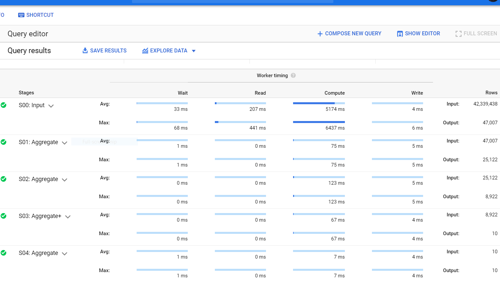

# Welcome to New York City Parking Tickets Data Analysis and Conclusions

# 1.	Motivation
500$ parking ticket issued...!! 🥵. If you’ve ever driven a car in New York City, you probably know the drill: The city’s free on-street parking gives a small, temporary benefit to a few lucky drivers. People tend to violate the parking rules creating big problems for everyone else. This unique dataset enlightens the causes and most frequent areas of parking breaches. If we care about cities and urban mobility, we really need to pay some attention to parking. If people are not parking correctly like taking place of two parking places for just one car, park in the handicapped reserved place. Without rationing, parking fills up due to illegal parking, double parking leading to traffic caused by parking search. Hence, parking has to be managed strictly by enforcing laws to prevent such problems. The outcome of the project will help the government plan for proper investment of resources and improve focus on regions where rate of parking violations is more and also concentrate on frequently occurring categories of violations. Also, we can ensure the Parking policy success from the analyzing the dataset further.
1)Where the rate of traffic rule violation is more i.e. more need of strict actions need to be taken by the traffic police?
	2)Which place is ideal in case of parking violations and no need of much attention as people are likely to follow all the rules? 
3)What is the rate of rule violations of the society and is the vehicle expired?
If you read further, you can get to know about the interesting things that can be analyzed from the dataset like what kind of parking violations would cost you more or less? Also, you can identify the regions where you should be more careful while violating the rules even for a couple of minutes. 
Apart from just these things we can further analyze to get the answers to following questions

# 2.	About the Data
Kaggle has so much interesting datasets to work on. I was searching for a large and interesting dataset so that I can put in my knowledge and skills acquired from the course to analyze by querying the Bigdata and visualizing the same. Here you can see the [data](https://www.kaggle.com/new-york-city/nyc-parking-tickets). The NYC Department of Finance collects data on every parking ticket issued in NYC (~10M per year!). This data is made publicly available to aid in ticket resolution and to guide policymakers.

Here is what the data looks like before filtering

```markdown
Summons Number,Plate ID,Registration State,Plate Type,Issue Date,Violation Code,Vehicle Body Type,Vehicle Make,Issuing Agency,Street Code1,Street Code2,Street Code3,Vehicle Expiration Date,Violation Location,Violation Precinct,Issuer Precinct,Issuer Code,Issuer Command,Issuer Squad,Violation Time,Time First Observed,Violation County,Violation In Front Of Or Opposite,House Number,Street Name,Intersecting Street,Date First Observed,Law Section,Sub Division,Violation Legal Code,Days Parking In Effect    ,From Hours In Effect,To Hours In Effect,Vehicle Color,Unregistered Vehicle?,Vehicle Year,Meter Number,Feet From Curb,Violation Post Code,Violation Description,No Standing or Stopping Violation,Hydrant Violation,Double Parking Violation,Latitude,Longitude,Community Board,Community Council ,Census Tract,BIN,BBL,NTA
1283294138,GBB9093,NY,PAS,08/04/2013,46,SUBN,AUDI,P,37250,13610,21190,20140831,0033,33,33,921043,0033,0000,0752A,,,F,712,W 175 ST,,0,408,F1,,BBBBBBB,ALL,ALL,GY,0,2013,-,0,,,,,,,,,,,,,
1283294151,62416MB,NY,COM,08/04/2013,46,VAN,FORD,P,37290,40404,40404,20140430,0033,33,33,921043,0033,0000,1240P,,NY,O,201,W 177 ST,,0,408,C,,BBBBBBB,ALL,ALL,WH,0,2012,-,0,,,,,,,,,,,,,
1283294163,78755JZ,NY,COM,08/05/2013,46,P-U,CHEVR,P,37030,31190,13610,20140228,0033,33,33,921043,0033,0000,1243P,,NY,O,520,W 163 ST,,0,408,F7,,BBBBBBB,ALL,ALL,,0,0,-,0,,,,,,,,,,,,,
1283294175,63009MA,NY,COM,08/05/2013,46,VAN,FORD,P,37270,11710,12010,20141031,0033,33,33,921043,0033,0000,0232P,,NY,O,517,W 176 ST,,0,408,F1,,BBBBBBB,ALL,ALL,WH,0,2010,-,0,,,,,,,,,,,,,
1283294187,91648MC,NY,COM,08/08/2013,41,TRLR,GMC,P,37240,12010,31190,0,0033,33,33,921043,0033,0000,1239P,,NY,F,590,W 174 ST,,0,408,E1,,BBBBBBB,ALL,ALL,BR,0,2012,-,0,,,,,,,,,,,,,
1283294217,T60DAR,NJ,PAS,08/11/2013,14,P-U,DODGE,P,37250,10495,12010,0,0033,33,33,921043,0033,0000,0617P,,NY,F,525,W 175 ST,,0,408,F1,,BBBBBBB,ALL,ALL,RD,0,0,-,0,,,,,,,,,,,,,
1283294229,GCR2838,NY,PAS,08/11/2013,14,VAN,,P,37250,12010,31190,20141223,0033,33,33,921043,0033,0000,0741P,,NY,F,551,W 175 ST,,0,408,C,,BBBBBBB,ALL,ALL,GN,0,2011,-,0,,,,,,,,,,,,,
1283983620,XZ764G,NJ,PAS,08/07/2013,24,DELV,FORD,X,63430,0,0,0,0088,88,976,101079,0976,0000,0425A,,K,F,100,N.PORTLAND AVE,BROOKLYN NY 11206,0,408,E5,,BBBBBBB,ALL,ALL,WHITE,0,0,-,0,,,,,,,,,,,,,
1283983631,GBH9379,NY,PAS,08/07/2013,24,SDN,TOYOT,X,63430,0,0,20140722,0088,88,976,101079,0976,0000,0437A,,K,F,100,N.PORTLAND AVE,BROOKLYN NY 11206,0,408,D5,,BBBBBBB,ALL,ALL,WHITE,0,2001,-,0,,,,,,,,,,,,,
``` 
 
There are four .CSV files, covering Aug 2013-June 2017. The files are roughly organized by fiscal year (July 1 - June 30) with the exception of the initial dataset. I have considered the following features from the dataset.


See the dataset descriptions for exact details. Columns include information about the vehicle ticketed, the ticket issued, location and time.


# 3.	Obtaining the Data & Preprocessing

I directly downloaded the files from the Kaggle and stored in the local machine first.

Feature selection and uploading to GCS
Each file is of 2 GB approx. Some of the columns are not necessary for the analysis, so ran the following python script to extract the useful features only from all the raw data before uploading it to Google cloud storage.

```markdown
import os
import json
import pandas as pd

add_header = True
chunksize = 10 ** 5
my_path = "D:/nyc-parking-tickets/"

for r, d, f in os.walk(my_path):
    for curr_file in f:
        print(curr_file)
        for chunk in pd.read_csv(my_path + curr_file, chunksize=chunksize, usecols = ['Summons Number','Plate ID','Registration State','Issue Date','Violation Code','Vehicle Body Type','Violation Location','Issuer Code','Violation County','Unregistered Vehicle?','Violation Description']):
            chunk.to_csv("D:/updated-nyc-parking-tickets/" + curr_file,
                         mode='a', index=False, header=add_header)
            if add_header:
                add_header = False
```

All the four csv files of size 4.0 GB in total are uploaded on the GCS by running the following google command line instruction: 

```markdown
<p class="hey">gsutil -o GSUtil:parallel_composite_upload_threshold=150M -m cp -r FOLDERNAME/FILENAME gs://BUCKET_PATH</p>
```

References for the commands to upload to GCS can be found [here](https://cloud.google.com/storage/docs/gsutil/commands/cp#synopsis).

# 4.	BigQuery

With help of Big Query “[Loading data from cloud storage](https://cloud.google.com/bigquery/docs/loading-data-cloud-storage#overview)” feature I have created the table in Big Query with auto schema detection option.
There are multiple options for uploading like
-	Uploading from Local Storage ([Guide](https://cloud.google.com/bigquery/docs/loading-data-cloud-storage#overview)).
-	Uploading from GCS ([Guide](https://cloud.google.com/bigquery/docs/loading-data-local#overview)).
-	There are multiple other options you can get [here](https://cloud.google.com/bigquery/docs/loading-data-local#overview).

Loading the data to BigQuery directly from Web UI has some constraints like:
1) Data should be less than 10 MB.
2) Total number of rows of data should be less than 16000.
For my case the data is about 4 GB so, I uploaded the data to GCS first and then moved it to BigQuery from GCS Bucket. If your datasets satisfy the first two conditions then you can directly load the data to BigQuery from WebUI. You can find different options for uploading the data to BigQuery [here](https://cloud.google.com/bigquery/docs/loading-data#overview).

Here are some of the snapshots how the dataset is seen on the BigQuery WebUI.

I added all the data from the CSV files into a single BigQuery table called `cs-686-dpc-269721.perosnal_project.parking_tickets_info_main` 

Data types of the columns


Data samples in BigQuery Web UI


I am using [Google's Data Studio](https://datastudio.google.com/u/0/navigation/) for binding BigQuery and UI.

This is how my dashboard looks like after analyzing the dataset using BigQuery.


## Analytics
Analysis dashboard with the help of Google's Data Studio and Big Queries as back0end for analysis.
<iframe width="600" height="650" src="https://datastudio.google.com/embed/reporting/75878ddf-96a5-4fcf-998e-8a1d8c47d8c5/page/qlD" frameborder="0" style="border:0" allowfullscreen></iframe>


### Analysis of data

	After creating the tables with the dataset, I queried and visualized the data using BIgQuery Web UI and selected few columns for the analysis of the data.
	
There are total of 10 charts or representations of different analysis I have made from the data.
1] It further has more subsections to show the total number of parking violations in different fields.
	i] It shows the total number of parking tickets issued in the five years 2013 to 2017.  
	ii] It shows the total number of parking tickets issued in the year 2013. 
	iii] It shows the total number of parking tickets issued in the year 2014.
	iv] It shows the total number of parking tickets issued in the year 2015.
	v] It shows the total number of parking tickets issued in the year 2016.
	vi] It shows the total number of parking tickets issued in the year 2017.
	
2] It shows the bar chart of tickets issued per violation type. Each violation type is represented by distinct violation code.	

3] This is the support table for the table 2] to show the meanings of each violation code for refference.

4] This shows the counties with most parking tickets issued. So they have more parking violations. And we can clearly see that the NY is at the top. So We can clearly conclude from this that the more strict actions should be taken in the NY which was one of our aim from this project. Government can focus more on the states with this more violating states.

5] This shows that which officer has issued more parking tickets. We can get the list of officers which are giving their best to stop the parking violations. Givernment can give awards to such officers to inspire other officers also.

6] This shows that for each county which violation is happening most number of times. So that the officers can focus more on the perticular type of violations more.

7] It considers a perticular vehicle body type as red if it has been issued a parking tickets in more than one month in a year other wise it shows green. So we can clearlly see that the red one is more than the green so most of the vehicle types are red zoned. This information may help officers to focus on a perticular vehicle types more rather than getting into all traffic.

8] It considers a person red zoned if his vehicle is found to have issued tickets more than 30 times. Similarly orange zoned if tickets issued are more than 5 but less than 30. Other wise the person is green. Officers can really look into this ratio and make a more strict rules for the red zoned persons as they are continuously breaking the rules.

9] The pie chart shows the vioalations happened in per state. We can clearly see that NY is way beyond all others. So it requires a more attention in comarison with other states. Also we can see the states with very less violation rate. So officers can use this data to check the systems or special rules in the perticular states with less violations.

10] This bar chart shows the comparison between the violations happened in the top 5 states with most number of violations per year. We can see the changes from it and see that rules are good. But can be improved more.

Clearly from the charts above we can see that I was aiming for the analysis in the motivation which are almost solved by this analysis but there are still some more things we can add in future.

### Challenges
1] Skew data: The data was not precise and accurate. As data was having so many null values and also years from after 2017 or before 2013 also. It impacts the performance of the analysis and reduces the accuracy. It was a bit difficult to get the relevant information from the dataset. The data was containing most of the relevant information and focusing on most of the irrelevant data. So apart from this fetting the relevant data was a challenging task for me. 

2] Mis-matching data-types: the data-types of the data was not the same or incorrect. So schema auto-detection was not able to get the whole dara directly into the singlen table. So querying and adding the data to tables becomes tedious. So I created my schema manually to overcome this.

3] Missing data: There were so many data values missing like UnRegistered Vehicle. Some years was having some columns completely null. 
Also most of the data was missing so making analysis based in that was bit complex as it reduces the accuracy. I overcome this by considering the columns with values only. So I considered it as other for all necessary times.

4] No imports for Data-studio: The Goggle's Data Studio was not allowing the java script UDFs which has imports. It was not handling the functions like array aggregator which was necessary sometimes. So I stored the results in other table and then queried that results again for the visualiation. It was a bit tedious as it takes more table creation. It could have been improved.

### Future Work
1] By using this data, the analysis which I made is pretty amazing. It almost answers all the questions I was aiming for but it can still be more precise and accurate if we get more data.
<br/>
2] Also the analysis of location was according to the states and counties which is a lot of help for the Government officers. But for police officers it will be really good if the locations are detailed like co-ordinates on Google Maps. It can be added in future which will be really helpfull for the officers.
<br/>
3] Also the analysis was on a superficial level. It can be more detailed if there is more data and more information about the officers working and what are their revieews about the work.

### Why Big Query ? (🤔)[Reference](https://cloud.google.com/bigquery/)
Big Query provides really usefull features for such analysis. It also has a good set of optimzation features which is really needed ton handle the Big data.

Some of those featurres which mainly attracts me towards Big Query are:<br/>
1]BigQuery is hepful for calculating metrics/stats/aggregates over a big data.<br/>
2]It has a really faster and user-friendly Web-UI which is easy to learn and use.<br/>
3]Querying was really fun on BigQuery Web UI.<br/>
4]Loading such amount of data to BigQuery is rather easier than others as there re many ways.<br/>
5]More importantly, it is easy to integrate with the Google's Data Studio.<br/>
6]Also we can get live data so, it is really amazing for visualization of streaming data.<br/>
7]Mainly, it supports SQL which is easy and friendly for handling complex queries on data.<br/>
8]It supports the UDFs , so it was easy for me to use the UDF in JS to have my complex works.<br/>

### Query Execution Details

Below is the execution details for some of the complex queries I used.

1. Table 1[Vehicle body type zonal distribution]


2. Table 2[Per Person total violation zone calculation]


3. Table 3[types of top 3 violations in violation counties according to number of violations]


### Support or Contact

[New york City Parking tikcets violation is analyzed by @Vaishnav Kshirsagar](https://github.com/vpkshirsagar/PersonalProject) and I’ll help you sort it out.
